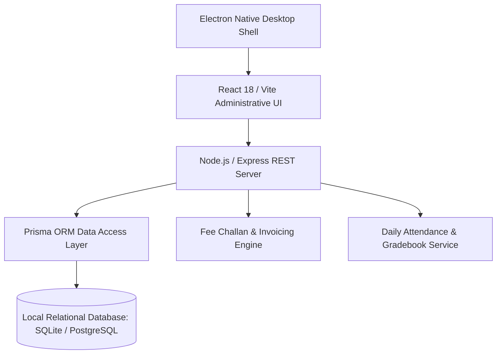

# EduAdmin — Desktop School Management & Student Administration System

<div align="center">

[](https://github.com/abdussatarkhan)
[](https://github.com/abdussatarkhan)
[](https://github.com/abdussatarkhan)

</div>

[](https://github.com/abdussatarkhan/school-desktop-app/actions)
[](https://www.electronjs.org/)
[](https://react.dev/)
[](https://nodejs.org/)
[](https://www.prisma.io/)

> **A modern desktop school information and administration system engineered with Electron, React (Vite), Node.js/Express, and Prisma ORM — streamlining student admissions, enrollment records, classroom attendance, fee challan generation, and academic gradebook report cards.**

---

## 🏛️ System Architecture



---

## 🌟 Key Features & Capabilities

- **🖥️ Cross-Platform Electron Desktop Shell**: Native desktop application with optimized IPC communication between the React administrative user interface and the local Node.js Express server.
- **🎓 Student Information & Admissions**: Complete student demographic records, registration numbering, class section allocations, and guardian contact details.
- **💵 Fee Invoicing & Challan Generation**: Automated monthly fee voucher generation, scholarship deductions, fine calculation, and payment status tracking.
- **📊 Attendance & Academic Gradebook**: Daily period-wise attendance logging, exam term grade recordings, and printable academic student report cards.

---

## 🚀 Quickstart & Setup

### Prerequisites
- [Node.js 18+](https://nodejs.org/en/download/)
- npm or yarn

### 1. Clone the Repository
```bash
git clone https://github.com/abdussatarkhan/school-desktop-app.git
cd school-desktop-app
```

### 2. Install Dependencies & Build
```bash
# Install root workspace dependencies
npm install

# Setup backend and Prisma database
cd backend
npm install
npm run db:generate
cd ..

# Setup frontend dependencies
cd frontend
npm install
cd ..

# Launch the desktop application in development mode
npm run dev
```

For building production desktop binaries (.exe / .dmg / AppImage), refer to [`DESKTOP_BUILD_GUIDE.md`](DESKTOP_BUILD_GUIDE.md).

---

## 🖥️ Application & Operational Interface

<p align="center">
  
</p>

> [!TIP]
> You can also explore [`dashboard.html`](dashboard.html) directly in any modern browser for a standalone interface walkthrough.

---

## 🗺️ Roadmap & Upcoming Enhancements

- [x] Electron + React 18 desktop architecture with Prisma ORM
- [x] Student admission and class enrollment directory
- [x] Fee voucher calculation and receipt generation
- [ ] Automated SMS notification dispatch to parents upon absence
- [ ] Biometric fingerprint scanner hardware integration
- [ ] Teacher payroll and staff leave management module

---

## 👨‍💻 Author & Contact

Built and maintained by **Abdussatar** ([@abdussatarkhan](https://github.com/abdussatarkhan)).  
For technical discussions, collaboration, or queries, feel free to reach out via [LinkedIn](https://www.linkedin.com/in/abdus-satar-5150813b5/) or [GitHub](https://github.com/abdussatarkhan).

---

## 📜 License

This project is licensed under the **MIT License** — see the LICENSE file for details.

---

<div align="center">

### 👨‍💻 Maintained by [Abdussatar (@abdussatarkhan)](https://github.com/abdussatarkhan)
Part of the **[Abdussatar Software Engineering & Systems Portfolio](https://github.com/abdussatarkhan)**.

⭐ If you find this project valuable, consider dropping a star! ⭐

</div>
